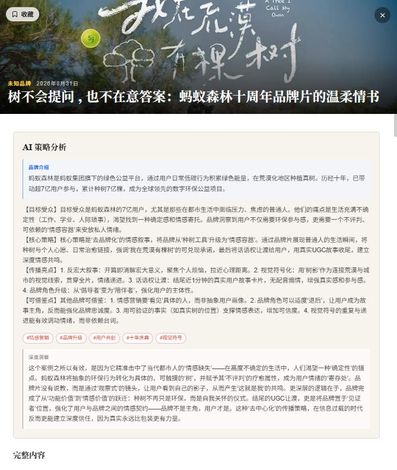

# Marketing Weekly · 营销案例AI分析工具
一个自动化的营销案例追踪与分析工具。从广告门等平台自动抓取最新营销案例，通过大模型生成策略分析，并呈现为杂志风格的周刊页面。

## 页面预览

## 功能特性
- 自动抓取：使用 Playwright 定时抓取广告门案例库，支持滚动加载和反爬策略
- AI 分析：调用大模型 API，自动生成品牌介绍、策略解读、标签体系和深度洞察
- 杂志风格周刊：纯白底 + 干净排版，Banner 轮播、卡片网格、弹窗详情
- 收藏功能：将有启发的案例存入数据库，随时回顾
- 响应式设计：完美适配桌面端和移动端

## 技术栈
- 前端框架：Next.js 14 (App Router) + React
- 编程语言：TypeScript
- 样式方案：Tailwind CSS
- 数据库：SQLite (开发) / PostgreSQL (生产)
- ORM：Prisma
- 爬虫引擎：Playwright
- AI 模型：DeepSeek API

## 快速开始
安装依赖：
pnpm install

配置环境变量，创建 .env.local 文件：
DATABASE_URL="file:./prisma/dev.db"
LLM_API_KEY="你的DeepSeek API Key"
LLM_BASE_URL="https://api.deepseek.com"

初始化数据库：
pnpm prisma db push

抓取案例：
pnpm run crawler

运行 AI 分析：
pnpm run analyzer

启动开发服务器：
pnpm run dev

访问 http://localhost:3000 即可预览周刊。

## 可用脚本
- pnpm run dev：启动开发服务器
- pnpm run build：构建生产版本
- pnpm run start：启动生产服务器
- pnpm run crawler：抓取广告门案例
- pnpm run analyzer：AI 分析未处理的案例
- pnpm run prisma:studio：打开 Prisma Studio 管理数据

## 数据模型
- id：主键
- title：案例标题
- cover_image_url：封面图
- brief：简介
- full_content_html：完整正文 HTML
- brand：品牌名称
- publish_date：发布日期
- source_url：原文链接（唯一）
- ai_strategy_analysis：AI 策略分析
- ai_tags：AI 标签（JSON 字符串）
- ai_deep_insight：AI 深度洞察
- collected：是否收藏
- created_at：创建时间

## 作者
Cheryl
GitHub: https://github.com/cheryl4cher

## 致谢
- 案例数据来源：广告门
- AI 能力由 DeepSeek 提供
